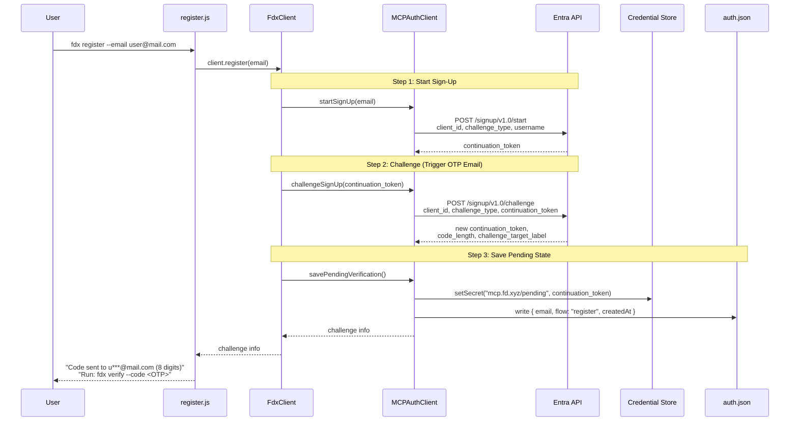
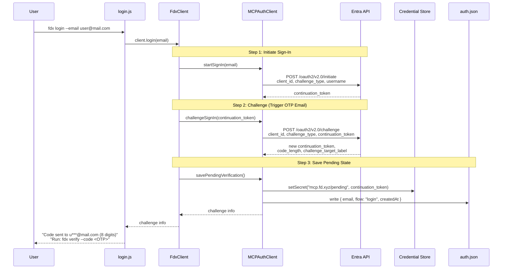
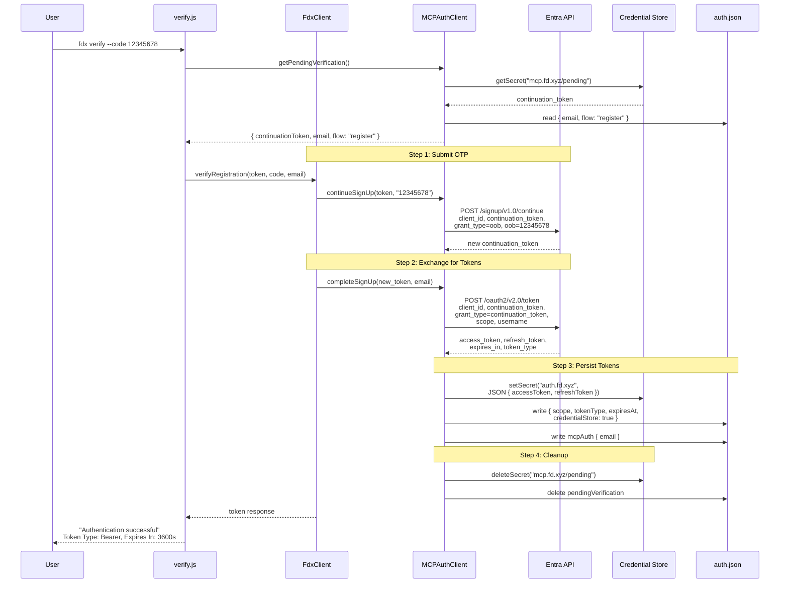
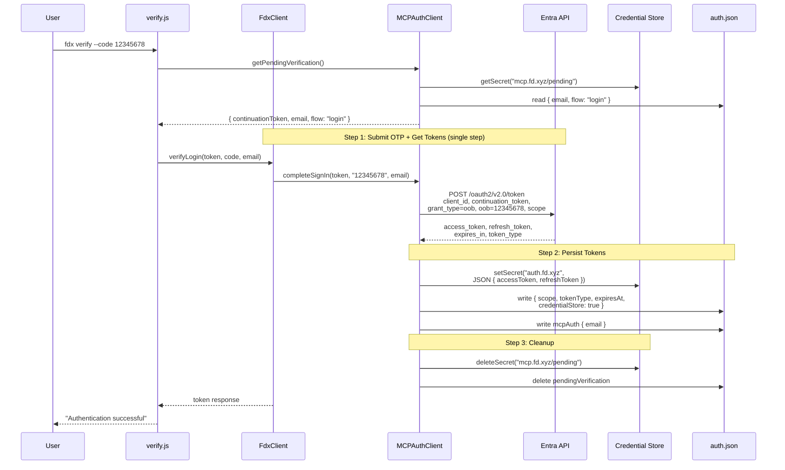
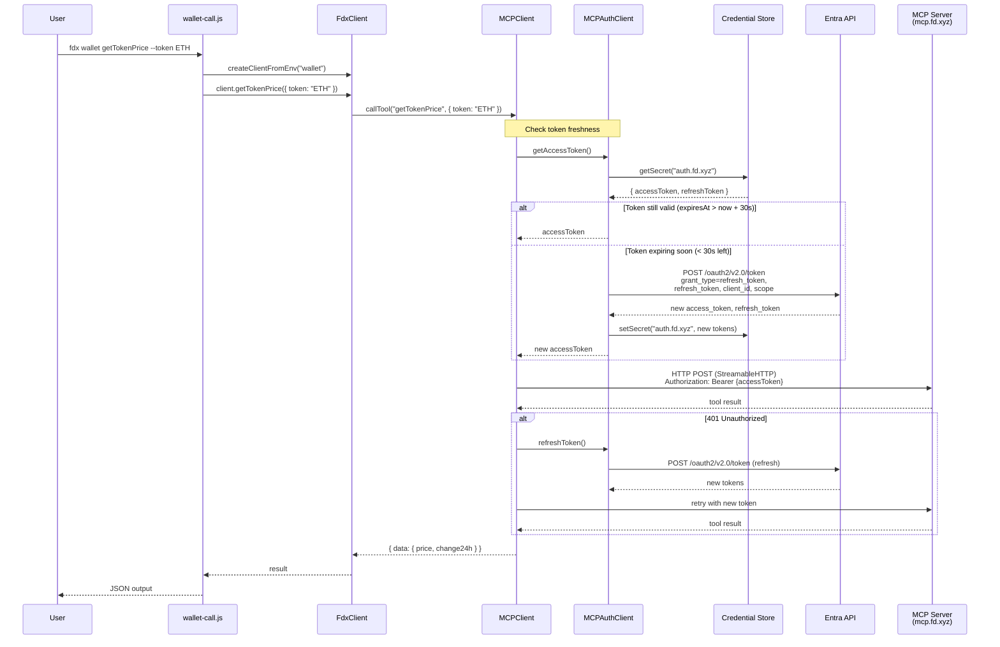
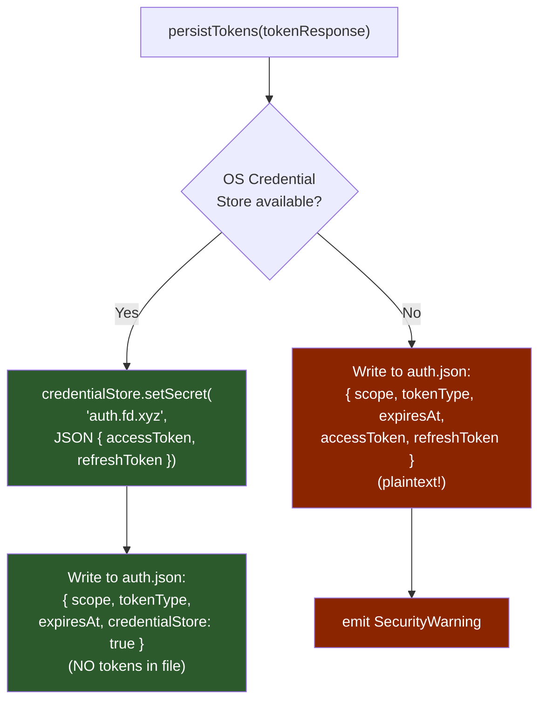
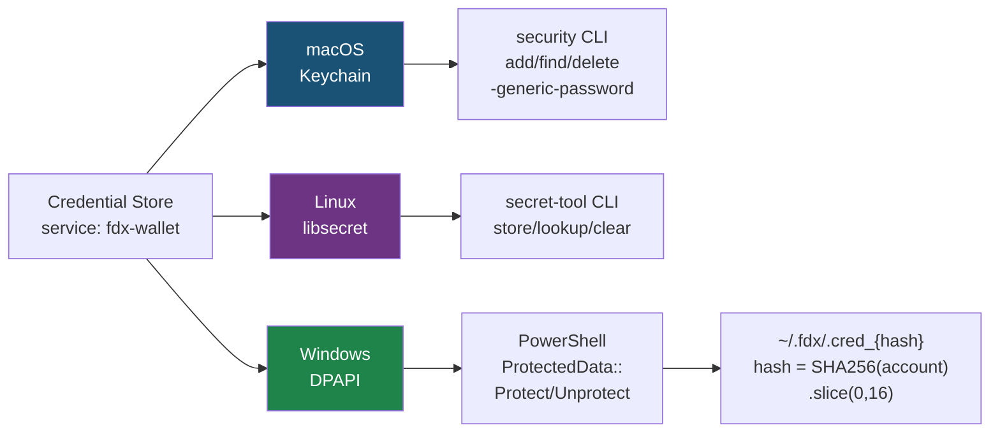

# Diagram: Auth Flow in FD Agent Wallet CLI
(Microsoft Entra External ID Native Authentication — no browser, fit for AI agents, containers, CI pipelines.)
## ASCII Version

```
                         FD Agent Wallet CLI - Auth Architecture
  =====================================================================================

  USER                    CLI Commands              Core Layer                 External
  ----                    ------------              ----------                 --------

                     +------------------+     +----------------+
  fdx register       | register.js      |---->| FdxClient      |
  --email xxx        +------------------+     |                |
                                              |  .register()   |
                     +------------------+     |  .login()      |     +------------------+
  fdx login          | login.js         |---->|  .verify*()    |     | MCPAuthClient    |
  --email xxx        +------------------+     |  .logout()     |---->|                  |
                                              |  .getToken     |     |  startSignUp()   |
                     +------------------+     |   State()      |     |  challengeSignUp |
  fdx verify         | verify.js        |---->|                |     |  continueSignUp()|
  --code 12345678    +------------------+     +-------+--------+     |  completeSignUp()|
                                                      |             |                  |
                     +------------------+             |             |  startSignIn()   |
  fdx status         | status.js        |-------------+             |  challengeSignIn |
                     +------------------+             |             |  completeSignIn()|
                                                      |             |                  |
                     +------------------+             |             |  refreshToken()  |
  fdx logout         | logout.js        |-------------+             |  getAccessToken()|
                     +------------------+                           +--------+---------+
                                                                             |
                                                                             |  HTTP POST
                                                                             |  (axios)
                                              +------------------+           |
                                              | Credential Store |           v
                                              |                  |  +------------------+
                                              | macOS: Keychain  |  | Microsoft Entra  |
                                              | Linux: libsecret |  | External ID      |
                                              | Win:   DPAPI     |  |                  |
                                              +--------+---------+  | /signup/v1.0/*   |
                                                       |            | /oauth2/v2.0/*   |
                                              +--------+---------+  +------------------+
                                              | ~/.fdx/auth.json |
                                              | (metadata +      |
                                              |  fallback tokens)|
                                              +------------------+
```

## Mermaid: Register Flow



## Mermaid: Login Flow



## Mermaid: Verify Flow (Register Branch)



## Mermaid: Verify Flow (Login Branch)



## Mermaid: Token Refresh + MCP Call Flow



## Mermaid: Token Storage Strategy



## Mermaid: Credential Store per OS


